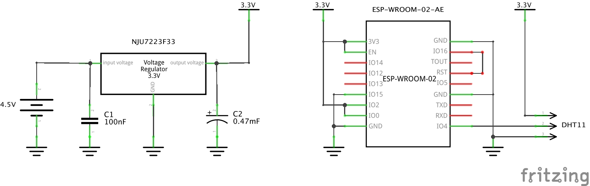
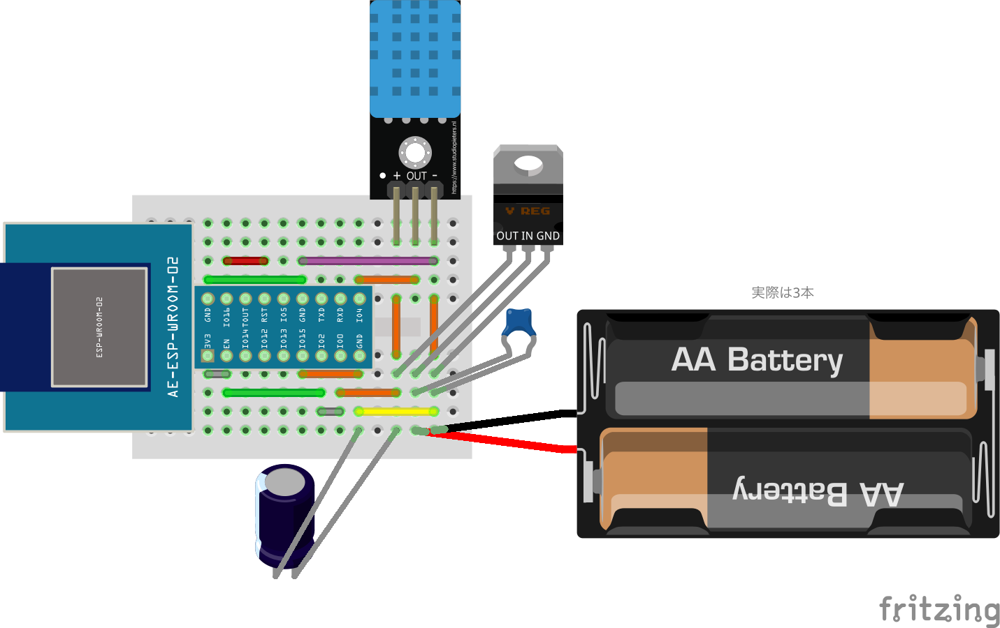

# uchino-sensors

温湿度センサーで値をとってグラフにする

## 概要

1. ESP8266 と DHT11 で Wi-Fi 温湿度センサーを作成し、10分ごとに測定
2. AWS IoT Core で測定データの MQTT メッセージを受け取り、DynamoDB に書き込む
3. AWS Amplify で作成した Web アプリ上で、測定データをグラフとして可視化

詳細については以下をご覧ください。

- 発表スライド: https://speakerdeck.com/mashabow/fftt-number-437
- ブログ記事: [ESP8266 で温湿度を測って、AWS IoT Core + Amplify でグラフにしてみる - Feedforce Developer Blog](https://developer.feedforce.jp/entry/2021/04/28/110000)

## 回路図

